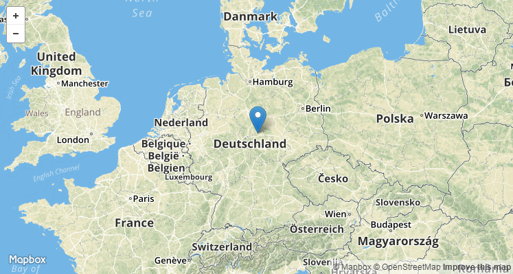

# Getty TGN JSON

*Stand: 08.06.2017*

## GET JSON

` GET http://localhost:8084/gettytgn-json/getJSON`

### Description

Gibt eine JSON Repräsentation, bzw. GeoJSON einer *Getty Thesaurus of Geographic Names* Ressource zurück.

Hierzu wird der **[SPARQL endpoint](http://vocab.getty.edu/sparql)** von Getty genutzt.

**[Beispielabfrage](http://vocab.getty.edu/sparql?query=prefix+ontogeo%3A+%3Chttp%3A%2F%2Fwww.ontotext.com%2Fowlim%2Fgeo%23%3E%0D%0Aprefix+geo%3A+%3Chttp%3A%2F%2Fwww.w3.org%2F2003%2F01%2Fgeo%2Fwgs84_pos%23%3E%0D%0Aprefix+skos%3A+%3Chttp%3A%2F%2Fwww.w3.org%2F2004%2F02%2Fskos%2Fcore%23%3E%0D%0Aprefix+tgn%3A+%3Chttp%3A%2F%2Fvocab.getty.edu%2Ftgn%2F%3E%0D%0Aprefix+foaf%3A+%3Chttp%3A%2F%2Fxmlns.com%2Ffoaf%2F0.1%2F%3E%0D%0Aprefix+gvp%3A+%3Chttp%3A%2F%2Fvocab.getty.edu%2Fontology%23%3E%0D%0Aprefix+skosxl%3A+%3Chttp%3A%2F%2Fwww.w3.org%2F2008%2F05%2Fskos-xl%23%3E%0D%0Aselect+%3Fname+%3Flat+%3Flong+%3FparentString+%3Fpreflabel+%3Faltlabel+%3Fscopenote+%3Fplacetypepreferred+%3Fplacetypenonpreferred+%3Fid+where+%7B%0D%0A+%3Fplace+gvp%3AprefLabelGVP+%5Bskosxl%3AliteralForm+%3Fname%5D+.%0D%0A+%3Fplace+foaf%3Afocus+%5Bgeo%3Alat+%3Flat%5D.%0D%0A+%3Fplace+foaf%3Afocus+%5Bgeo%3Along+%3Flong%5D.%0D%0A+%3Fplace+gvp%3AparentString+%3FparentString+.%0D%0A+%3Fplace+skosxl%3AprefLabel+%5Bskosxl%3AliteralForm+%3Fpreflabel%5D+.%0D%0A+%3Fplace+skosxl%3AaltLabel+%5Bskosxl%3AliteralForm+%3Faltlabel%5D+.%0D%0A+%3Fplace+skos%3AscopeNote+%5Brdf%3Avalue+%3Fscopenote%5D+.%0D%0A+%3Fplace+gvp%3AplaceTypePreferred+%5Bgvp%3AprefLabelGVP+%5Bskosxl%3AliteralForm+%3Fplacetypepreferred%5D%5D+.%0D%0A+%3Fplace+gvp%3AplaceTypeNonPreferred+%5Bgvp%3AprefLabelGVP+%5Bskosxl%3AliteralForm+%3Fplacetypenonpreferred%5D%5D+.%0D%0A+%3Fplace+dc%3Aidentifier+%3Fid.%0D%0A+FILTER%28%3Fplace%3D%3Chttp%3A%2F%2Fvocab.getty.edu%2Ftgn%2F7000084%3E%29%0D%0A%7D&_implicit=false&implicit=true&_equivalent=false&_form=%2Fsparql)** für http://vocab.getty.edu/tgn/7000084 (Deutschland):

```sparql
prefix ontogeo: <http://www.ontotext.com/owlim/geo#>
prefix geo: <http://www.w3.org/2003/01/geo/wgs84_pos#>
prefix skos: <http://www.w3.org/2004/02/skos/core#>
prefix tgn: <http://vocab.getty.edu/tgn/>
prefix foaf: <http://xmlns.com/foaf/0.1/>
prefix gvp: <http://vocab.getty.edu/ontology#>
prefix skosxl: <http://www.w3.org/2008/05/skos-xl#>
select ?name ?lat ?long ?parentString ?preflabel ?altlabel ?scopenote ?placetypepreferred ?placetypenonpreferred ?id where {
 ?place gvp:prefLabelGVP [skosxl:literalForm ?name] .
 ?place foaf:focus [geo:lat ?lat].
 ?place foaf:focus [geo:long ?long].
 ?place gvp:parentString ?parentString .
 ?place skosxl:prefLabel [skosxl:literalForm ?preflabel] .
 ?place skosxl:altLabel [skosxl:literalForm ?altlabel] .
 ?place skos:scopeNote [rdf:value ?scopenote] .
 ?place gvp:placeTypePreferred [gvp:prefLabelGVP [skosxl:literalForm ?placetypepreferred]] .
 ?place gvp:placeTypeNonPreferred [gvp:prefLabelGVP [skosxl:literalForm ?placetypenonpreferred]] .
 ?place dc:identifier ?id.
 FILTER(?place=<http://vocab.getty.edu/tgn/7000084>)
}
```

### Requires authentication

none

### Parameters

* **uri** *(mendatory)* — Getty TGN URI (z.B. http://vocab.getty.edu/tgn/7000084).
* **format** *(optional)* — geojson, sonst json by default.

### Headers

`Accept: application/json`

`Accept: application/vnd.geo+json`

### Return format

Ein JSON Object mit allen Informationen der Getty TGN Ressource.

### Response (Example JSON)

`http://localhost:8084/gettytgn-json/getJSON?uri=http://vocab.getty.edu/tgn/7000084`

```json
{
	"scopenotes": [{
		"lang": "en",
		"value": "The area of north-central Europe occupied by what is now modern Germany measures some 137,828 square miles in size. Teutons, Celts, Slavs, and Balts inhabited it by the first century BCE. Part of the area was ruled by Romans, then Carolingians. Through the centuries, it was often broken into various states based on ethnic groups including the Alemanni, Bavarians, Upper and Lower Franks, Thuringians, and Frisians. It undertook expansion during the 19th to mid-20th centuries. The official language is German, although Low German is still spoken in the rural North. The 2004 estimated population was 82,633,200."
	}],
	"name": {
		"lang": "de",
		"value": "Deutschland"
	},
	"altlabels": [{
		"lang": "de",
		"value": "Bundesrepublik Deutschland"
	}, {
		"lang": null,
		"value": "Deutschland, Bundesrepublik"
	}, {
		"lang": "en",
		"value": "Federal Republic of Germany"
	}, {
		"lang": null,
		"value": "Germany, Federal Republic of"
	}, {
		"lang": "fr",
		"value": "République fédérale d'Allemagne"
	}, {
		"lang": "es",
		"value": "República Federal de Alemania"
	}, {
		"lang": null,
		"value": "Alemanha"
	}, {
		"lang": null,
		"value": "Duitsland"
	}, {
		"lang": "it",
		"value": "Germania"
	}, {
		"lang": "en",
		"value": "German"
	}, {
		"lang": null,
		"value": "Duitschland"
	}, {
		"lang": "ru",
		"value": "Федеративая Республика Германия"
	}, {
		"lang": "zh",
		"value": "德意志联邦共和国"
	}, {
		"lang": "ar",
		"value": "جُهور ةً ألماه اَ الاتحاد ةً"
	}, {
		"lang": null,
		"value": "GM"
	}, {
		"lang": null,
		"value": "GM00"
	}, {
		"lang": null,
		"value": "ISO276"
	}, {
		"lang": null,
		"value": "DEU"
	}, {
		"lang": null,
		"value": "DE"
	}, {
		"lang": null,
		"value": "BRD"
	}, {
		"lang": null,
		"value": "Deutsches Reich"
	}, {
		"lang": null,
		"value": "ISO280"
	}],
	"parentString": "Europe, World",
	"playetypespreferred": [{
		"lang": "en",
		"value": "nations"
	}],
	"id": "7000084",
	"lat": 51.5,
	"long": 10.5,
	"preflabels": [{
		"lang": "de",
		"value": "Deutschland"
	}, {
		"lang": "en",
		"value": "Germany"
	}, {
		"lang": "fr",
		"value": "Allemagne"
	}, {
		"lang": "es",
		"value": "Alemania"
	}, {
		"lang": "la",
		"value": "Germania"
	}, {
		"lang": "ru",
		"value": "Германия"
	}, {
		"lang": "zh",
		"value": "德国"
	}, {
		"lang": "ar",
		"value": "ألماه اَ"
	}],
	"playetypesnonpreferred": [{
		"lang": "en",
		"value": "primary political entities"
	}, {
		"lang": "en",
		"value": "republics"
	}, {
		"lang": "en",
		"value": "independent political entities"
	}, {
		"lang": "en",
		"value": "independent sovereign nations"
	}]
}
```

### Response (Example GeoJSON)

`http://localhost:8084/gettytgn-json/getJSON?uri=http://vocab.getty.edu/tgn/7000084&format=geojson`



```json
{
	"geometry": {
		"coordinates": [10.5, 51.5],
		"type": "Point"
	},
	"type": "Feature",
	"properties": {
		"scopenotes": [{
			"lang": "en",
			"value": "The area of north-central Europe occupied by what is now modern Germany measures some 137,828 square miles in size. Teutons, Celts, Slavs, and Balts inhabited it by the first century BCE. Part of the area was ruled by Romans, then Carolingians. Through the centuries, it was often broken into various states based on ethnic groups including the Alemanni, Bavarians, Upper and Lower Franks, Thuringians, and Frisians. It undertook expansion during the 19th to mid-20th centuries. The official language is German, although Low German is still spoken in the rural North. The 2004 estimated population was 82,633,200."
		}],
		"name": {
			"lang": "de",
			"value": "Deutschland"
		},
		"altlabels": [{
			"lang": "de",
			"value": "Bundesrepublik Deutschland"
		}, {
			"lang": null,
			"value": "Deutschland, Bundesrepublik"
		}, {
			"lang": "en",
			"value": "Federal Republic of Germany"
		}, {
			"lang": null,
			"value": "Germany, Federal Republic of"
		}, {
			"lang": "fr",
			"value": "République fédérale d'Allemagne"
		}, {
			"lang": "es",
			"value": "República Federal de Alemania"
		}, {
			"lang": null,
			"value": "Alemanha"
		}, {
			"lang": null,
			"value": "Duitsland"
		}, {
			"lang": "it",
			"value": "Germania"
		}, {
			"lang": "en",
			"value": "German"
		}, {
			"lang": null,
			"value": "Duitschland"
		}, {
			"lang": "ru",
			"value": "Федеративая Республика Германия"
		}, {
			"lang": "zh",
			"value": "德意志联邦共和国"
		}, {
			"lang": "ar",
			"value": "جُهور ةً ألماه اَ الاتحاد ةً"
		}, {
			"lang": null,
			"value": "GM"
		}, {
			"lang": null,
			"value": "GM00"
		}, {
			"lang": null,
			"value": "ISO276"
		}, {
			"lang": null,
			"value": "DEU"
		}, {
			"lang": null,
			"value": "DE"
		}, {
			"lang": null,
			"value": "BRD"
		}, {
			"lang": null,
			"value": "Deutsches Reich"
		}, {
			"lang": null,
			"value": "ISO280"
		}],
		"parentString": "Europe, World",
		"playetypespreferred": [{
			"lang": "en",
			"value": "nations"
		}],
		"id": "7000084",
		"lat": 51.5,
		"long": 10.5,
		"preflabels": [{
			"lang": "de",
			"value": "Deutschland"
		}, {
			"lang": "en",
			"value": "Germany"
		}, {
			"lang": "fr",
			"value": "Allemagne"
		}, {
			"lang": "es",
			"value": "Alemania"
		}, {
			"lang": "la",
			"value": "Germania"
		}, {
			"lang": "ru",
			"value": "Германия"
		}, {
			"lang": "zh",
			"value": "德国"
		}, {
			"lang": "ar",
			"value": "ألماه اَ"
		}],
		"playetypesnonpreferred": [{
			"lang": "en",
			"value": "primary political entities"
		}, {
			"lang": "en",
			"value": "republics"
		}, {
			"lang": "en",
			"value": "independent political entities"
		}, {
			"lang": "en",
			"value": "independent sovereign nations"
		}]
	}
}
```

### Response Codes

* *200 OK* — Everything worked fine.
* *500 Internal Server Error* — Some error on server side.
